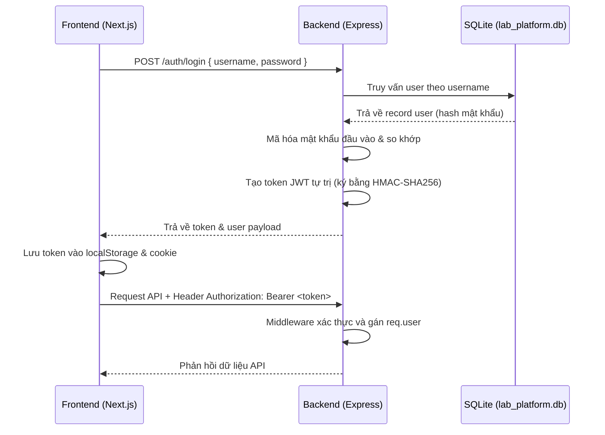

# 🔑 ĐẶC TẢ KIẾN TRÚC XÁC THỰC & PHÂN QUYỀN (AUTH & RBAC SPEC)

Tài liệu này đặc tả chi tiết kiến trúc giải pháp xác thực (Authentication) và phân quyền (RBAC - Role-Based Access Control) cho hệ thống Cloud Lab (Giai đoạn 6).

---

## 1. Tổng quan Kiến trúc

Hệ thống sử dụng cơ chế xác thực **Stateless Token** dựa trên chuẩn **JWT (JSON Web Token)** tự trị và phân quyền theo vai trò (RBAC) ở cả Backend (API level) và Frontend (UI level).



---

## 2. Thiết kế Cơ sở dữ liệu (Data Model Delta)

### 2.1 Bảng `users` (Bảng mới)
Lưu trữ thông tin tài khoản người dùng và vai trò phân quyền.

```sql
CREATE TABLE users (
  id TEXT PRIMARY KEY,
  username TEXT UNIQUE NOT NULL,
  password_hash TEXT NOT NULL,
  full_name TEXT NOT NULL,
  role TEXT NOT NULL CHECK(role IN ('student','instructor','admin')),
  student_code TEXT,           -- mã sinh viên, null nếu là giảng viên/admin
  email TEXT,
  created_at TEXT NOT NULL
);
```

### 2.2 Nâng cấp bảng `submissions` (Migration)
Bổ sung các trường thông tin phục vụ giám sát và chống gian lận trong các giai đoạn tiếp theo.

```sql
ALTER TABLE submissions ADD COLUMN user_id TEXT REFERENCES users(id);
ALTER TABLE submissions ADD COLUMN client_ip TEXT;
ALTER TABLE submissions ADD COLUMN hostname TEXT;
```

---

## 3. Cơ chế Mã hóa & Quản lý Token (Backend)

### 3.1 Mã hóa mật khẩu (Password Hashing)
- Sử dụng thuật toán **SHA256** tích hợp sẵn trong module `crypto` của Node.js để băm mật khẩu:
  `crypto.createHash("sha256").update(password).digest("hex")`
- Đảm bảo tính gọn nhẹ, loại bỏ hoàn toàn các lỗi xung đột biên dịch thư viện C++ gốc (như bcrypt) khi chạy đa nền tảng.

### 3.2 Tự xây dựng Token JWT (Zero-Dependency JWT)
Để tránh các rủi ro cài đặt thư viện bên thứ ba và tương thích offline, hệ thống tự trị tạo chữ ký token chuẩn JWT:
- **Header:** Base64Url encoded `{"alg": "HS256", "typ": "JWT"}`
- **Payload:** Base64Url encoded thông tin người dùng kèm thời gian hết hạn (`exp` = 24 giờ).
- **Signature:** Sinh bằng thuật toán `crypto.createHmac("sha256", SECRET)`.

---

## 4. Middleware & Phân quyền (RBAC)

### 4.1 Middleware `authenticateToken`
- Kiểm tra token gửi lên qua header `Authorization: Bearer <token>`.
- Giải mã chữ ký, kiểm tra tính hợp lệ và thời gian hết hạn.
- **Tính tương thích ngược (Backward Compatibility):** Nếu không nhận được token, middleware sẽ tự động fallback gán `req.user` về tài khoản mặc định `student` thay vì từ chối request. Cơ chế này giúp các script kiểm thử tự động của hệ thống (chạy qua CLI) không bị gián đoạn.

### 4.2 Middleware `requireRole(roles)`
- Ràng buộc quyền truy cập của các route quản trị chỉ dành cho Giảng viên (`instructor`) hoặc Quản trị viên (`admin`).
- Trả về mã lỗi `403 Forbidden` nếu vai trò hiện tại không nằm trong danh sách được cho phép.

---

## 5. Quản lý trạng thái và Bảo vệ UI (Frontend)

### 5.1 Zustand Store (`useAuthStore`)
- Quản lý trạng thái đăng nhập tập trung: `user`, `token`, `isAuthenticated`, `initialized`.
- Tự động đồng bộ token sang cả `localStorage` và `document.cookie` để hỗ trợ cả Client Components và Server Components/Middleware.

### 5.2 Trình bảo vệ định tuyến `AuthGuard`
- Chặn hiển thị nội dung trang học tập nếu chưa đăng nhập và tự động chuyển hướng (Redirect) về trang `/login` tương ứng theo ngôn ngữ hiện tại (`/vi/login` hoặc `/en/login`).
- Nếu đã đăng nhập thành công, tự động chuyển hướng ra khỏi trang `/login` để tránh đăng nhập lại.

### 5.3 Ẩn/Hiện Sidebar Layout (`LayoutContent`)
- Hỗ trợ ẩn hoàn toàn Sidebar điều hướng, Topbar Header, và Breadcrumbs khi người dùng đang ở trang `/login` để tối đa hóa không gian thiết kế màn hình đăng nhập.
- Tự động hiển thị lại khi chuyển hướng sang Dashboard.

---

## 6. Danh sách Tài khoản Kiểm thử Mặc định (Seeded Accounts)

Hệ thống tự động seed sẵn các tài khoản sau khi cơ sở dữ liệu khởi tạo lần đầu:

| Tên tài khoản (Username) | Mật khẩu (Password) | Tên đầy đủ (Full Name) | Vai trò (Role) | Mã sinh viên |
|---|---|---|---|---|
| `student` | `student123` | Sinh viên Demo | Sinh viên (`student`) | `B21DCCN001` |
| `instructor` | `instructor123` | Giảng viên Demo | Giảng viên (`instructor`) | *None* |
| `admin` | `admin123` | Quản trị viên | Quản trị viên (`admin`) | *None* |
