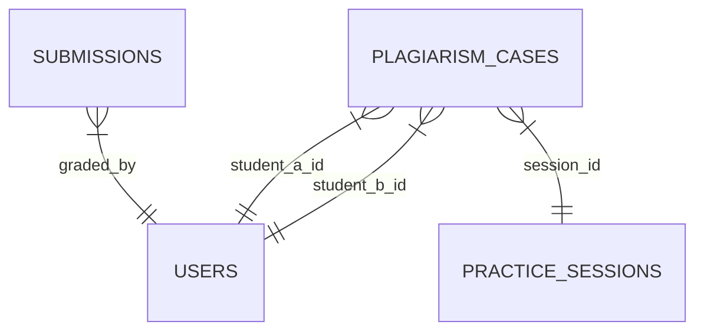

# Đặc tả Thiết kế: Hệ thống Giám sát, Chấm thủ công & Chống gian lận (Giai đoạn 8)

Tài liệu này đặc tả thiết kế kỹ thuật của phân hệ giám sát thi trực tiếp (real-time monitoring), chấm điểm thủ công (manual grading), thuật toán chống gian lận (plagiarism detection), và bảng xếp hạng ACM-ICPC đóng băng (frozen leaderboard).

---

## 1. Mở rộng Cơ sở dữ liệu (Database Extensions)

Để hỗ trợ ghi nhận kết quả chống gian lận và chấm điểm, cơ sở dữ liệu SQLite được mở rộng như sau:

### 1.1 Cập nhật bảng `submissions`
Bổ sung hai trường phục vụ chấm điểm và hậu kiểm:
- `result_code` (TEXT DEFAULT 'pending'): Mã kết quả chuyên sâu, nhận các giá trị:
  - `'AC'`: Accepted (Giải đúng bài).
  - `'WA'`: Wrong Answer (Sai kết quả).
  - `'WF'`: Wrong File (Lỗi nộp nhầm tệp tin).
  - `'WFN'`: Wrong File Name (Lỗi đặt sai tên tệp tin).
  - `'CPY'`: Plagiarism Confirmed (Phát hiện và xác nhận sao chép).
  - `'pending'`: Đang chờ chấm.
- `graded_by` (TEXT REFERENCES users(id)): Lưu UUID của giảng viên chấm thủ công bài làm này.

### 1.2 Bảng mới `plagiarism_cases` (Lưu vết sao chép)
Lưu trữ thông tin các bài làm nghi vấn sao chép có độ tương đồng cao:
- `id` (TEXT PRIMARY KEY): UUID của ca nghi vấn.
- `session_id` (TEXT REFERENCES practice_sessions(id) ON DELETE CASCADE): UUID ca thi.
- `lab_id` (TEXT NOT NULL): Mã bài lab bị trùng.
- `student_a_id` (TEXT REFERENCES users(id)): Sinh viên A.
- `student_b_id` (TEXT REFERENCES users(id)): Sinh viên B.
- `similarity_score` (REAL): Điểm số tương đồng tương đối (từ 0.0 đến 1.0).
- `code_a` (TEXT), `code_b` (TEXT): Đoạn mã nguồn thời điểm nộp bài của sinh viên A và B.
- `status` (TEXT DEFAULT 'pending'): Trạng thái duyệt (`pending` - chờ duyệt, `confirmed` - xác nhận sao chép, `dismissed` - bác bỏ).
- `created_at` (TEXT NOT NULL): Thời điểm quét.

---

## 2. Thuật toán Phát hiện Sao chép (Cosine Similarity of Token Frequencies)

Chúng tôi thiết kế thuật toán so khớp mã nguồn độc lập ở Backend, hoạt động qua hai giai đoạn:

### 2.1 Tiền xử lý & Token hóa (Tokenization)
1. Loại bỏ toàn bộ các comment dòng đơn và đa dòng (Python `#`, C/C++ `//` và `/* */`).
2. Loại bỏ các chuỗi hằng số (String literals) để tránh trường hợp đổi nội dung in ấn.
3. Chuyển đổi mã nguồn về chữ thường (lowercase) và trích xuất các từ tố alphanumeric (`\w+`).

### 2.2 Tính toán độ tương đồng Cosine
Hệ thống chuyển đổi danh sách tokens của hai bài nộp thành hai vector tần suất $A$ và $B$. Độ tương đồng được tính theo công thức Cosine giữa hai vector:

$$\text{Similarity}(A, B) = \frac{A \cdot B}{\|A\| \|B\|} = \frac{\sum_{i=1}^{n} A_i B_i}{\sqrt{\sum_{i=1}^{n} A_i^2} \sqrt{\sum_{i=1}^{n} B_i^2}}$$

Nếu $\text{Similarity}(A, B) \ge \text{Threshold}$ (Mặc định giảng viên cấu hình từ 70% trở lên), cặp bài nộp này sẽ được đánh dấu nghi vấn và ghi vào `plagiarism_cases`.

---

## 3. Quy trình Chấm điểm & Xử phạt

### 3.1 Xử phạt Gian lận (Plagiarism Enforcement)
Khi giảng viên nhấn nút **Xác nhận (Confirm)** trên một vụ việc:
1. Trạng thái của case trong `plagiarism_cases` cập nhật thành `'confirmed'`.
2. Hệ thống thực hiện cập nhật toàn bộ bài nộp của cả Sinh viên A và Sinh viên B cho bài Lab đó trong ca thi hiện tại:
   - Đặt `score = 0`.
   - Đặt `status = 'failed'`.
   - Đặt `result_code = 'CPY'`.
   - Ghi đè thông điệp phản hồi: `"Phát hiện sao chép mã nguồn (Plagiarism Confirmed)"`.

### 3.2 Chấm điểm Thủ công (Manual Evaluation)
Khi giảng viên click chấm điểm bài làm của học viên:
1. Giao diện tải trực tiếp mã nguồn sinh viên nộp vào bộ soạn thảo chỉ đọc.
2. Giảng viên nhập điểm số (0 - 100) và viết lời phê nhận xét.
3. Khi lưu:
   - Bài làm cập nhật trạng thái `status = 'graded'`.
   - Cập nhật `result_code = 'AC'` nếu $\ge 50$ điểm, ngược lại là `'WA'`.
   - Lưu thông tin tài khoản giảng viên thực hiện chấm vào `graded_by`.

---

## 4. Cơ chế Bảng xếp hạng ACM-ICPC & Đóng băng (Freeze)

Bảng xếp hạng ca thi được tính toán tự động dựa trên luật ACM-ICPC:

### 4.1 Quy tắc xếp hạng
1. **Số bài Accepted (AC) nhiều nhất:** Thí sinh giải đúng nhiều bài hơn sẽ xếp trên.
2. **Tổng điểm phạt (Penalty Time) ít nhất:** Nếu bằng số bài AC, thí sinh có tổng penalty nhỏ hơn sẽ xếp trên.
   - Điểm phạt một bài giải đúng = Thời gian nộp bài thành công (tính bằng số phút từ lúc bắt đầu ca thi) + $P \times$ (Số lần nộp sai trước khi AC).
   - $P$ là điểm phạt cấu hình (mặc định 20 phút).
   - Các bài chưa giải được (chưa AC) không cộng điểm phạt vào tổng chung.

### 4.2 Cơ chế Đóng băng Bảng điểm (Leaderboard Freeze)
Để tăng tính hấp dẫn và ngăn ngừa việc theo dõi bài giải của đối thủ ở những phút cuối:
- Nếu ca thi cấu hình `freeze_before_end_minutes > 0` (ví dụ: đóng băng 10 phút trước khi hết giờ).
- Khi thời gian hiện tại nằm trong khoảng đóng băng:
  - **Giảng viên/Giám thị:** Xem bảng xếp hạng đầy đủ (Unfrozen) cập nhật liên tục.
  - **Sinh viên:** Khi gọi API lấy bảng xếp hạng, Backend tự động quét và lọc:
    - Nếu bài giải đúng của thí sinh được nộp sau thời điểm đóng băng, hệ thống sẽ ẩn kết quả AC, chuyển trạng thái bài đó về "Đang chấm" (`isFrozen = true`, hiển thị dấu `?` hoặc không tính điểm).
    - Tính lại tổng điểm giải được và penalty tại thời điểm trước khi đóng băng để vẽ bảng xếp hạng công khai.
