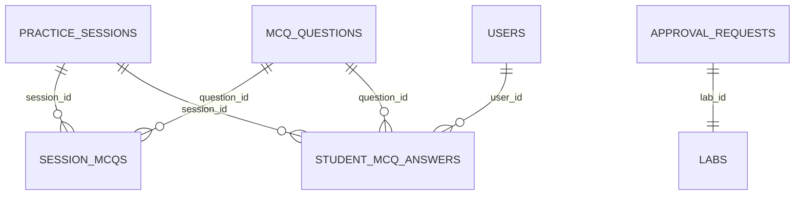

# Đặc tả Thiết kế: Hệ thống Trắc nghiệm (MCQ) & Phê duyệt bài thực hành (Giai đoạn 9)

Tài liệu này đặc tả thiết kế kỹ thuật của Phân hệ câu hỏi trắc nghiệm (MCQ) trong ca thi và Quy trình phê duyệt bài thực hành (Exercise Approval Workflow) dành cho Admin.

---

## 1. Mở rộng Cơ sở dữ liệu (Database Schema)

Phân hệ được tổ chức thông qua 4 bảng SQLite mới để đảm bảo tính độc lập và toàn vẹn dữ liệu:

### 1.1 Bảng `mcq_questions` (Ngân hàng câu hỏi trắc nghiệm)
- `id` (TEXT PRIMARY KEY): UUID/Mã định danh câu hỏi.
- `subject_id` (TEXT NOT NULL): Mã môn học (ví dụ: `algos`).
- `question_text` (TEXT NOT NULL): Nội dung câu hỏi (chấp nhận text/markdown).
- `options_json` (TEXT NOT NULL): Danh sách các phương án trả lời lưu dưới dạng JSON array (e.g. `["O(1)", "O(N)", "O(log N)"]`).
- `correct_option` (INTEGER NOT NULL): Chỉ số phương án đúng (0-based index).
- `explanation` (TEXT): Lời giải thích/đáp án chi tiết.
- `created_at` (TEXT NOT NULL): Thời gian tạo.

### 1.2 Bảng `session_mcqs` (Câu hỏi gán cho ca thi)
Gán tập hợp các câu hỏi trắc nghiệm được chỉ định thực hiện trong ca thực hành:
- `session_id` (TEXT REFERENCES practice_sessions(id) ON DELETE CASCADE)
- `question_id` (TEXT REFERENCES mcq_questions(id) ON DELETE CASCADE)
- PRIMARY KEY (`session_id`, `question_id`)

### 1.3 Bảng `student_mcq_answers` (Bài làm trắc nghiệm của sinh viên)
Ghi nhận kết quả trả lời từng câu của sinh viên:
- `session_id` (TEXT REFERENCES practice_sessions(id) ON DELETE CASCADE)
- `user_id` (TEXT REFERENCES users(id) ON DELETE CASCADE)
- `question_id` (TEXT REFERENCES mcq_questions(id) ON DELETE CASCADE)
- `selected_option` (INTEGER): Chỉ số phương án sinh viên chọn.
- `is_correct` (BOOLEAN): Trạng thái đúng/sai (0 hoặc 1) được tính tự động ở Backend để chống sửa điểm Client-side.
- `answered_at` (TEXT NOT NULL): Thời điểm tích chọn phương án.
- PRIMARY KEY (`session_id`, `user_id`, `question_id`)

### 1.4 Bảng `approval_requests` (Yêu cầu phê duyệt bài Lab)
Quy trình phê duyệt nội dung bài tập trước khi đưa vào giảng dạy công khai:
- `id` (TEXT PRIMARY KEY): Mã yêu cầu phê duyệt.
- `lab_id` (TEXT NOT NULL): Mã bài lab lập trình.
- `submitted_by` (TEXT REFERENCES users(id)): Gi giảng viên/tác giả soạn đề xuất.
- `status` (TEXT DEFAULT 'pending'): Trạng thái duyệt (`pending`, `approved`, `rejected`).
- `comments` (TEXT): Lời phê hoặc hướng dẫn chỉnh sửa từ Quản trị viên (Admin).
- `reviewed_by` (TEXT REFERENCES users(id)): Admin trực tiếp kiểm duyệt.
- `created_at` (TEXT NOT NULL): Thời điểm gửi duyệt.
- `updated_at` (TEXT): Thời điểm cập nhật trạng thái duyệt.

---

## 2. Quy trình Nghiệp vụ (Workflows)

### 2.1 Tự động lưu & Chấm điểm Trắc nghiệm
1. **Auto-save (Tự động lưu):** Khi sinh viên nhấn tích chọn một phương án A, B, C, D trên giao diện, frontend tự động gọi API `POST /sessions/:id/mcqs/submit` gửi đáp án lên server. Backend lưu ngay vào bảng `student_mcq_answers`, tránh mất mát dữ liệu do rớt mạng hoặc reload.
2. **Auto-grading (Chấm điểm tự động):** Backend tự động so khớp `selected_option` với `correct_option` trong bảng `mcq_questions`. Trạng thái `is_correct` được tính và ghi vào DB. Kết quả trả về gồm số câu đúng và điểm số quy đổi hệ 100.

### 2.2 Quy trình Phê duyệt Bài thực hành
1. **Gửi duyệt (Submit Request):** Giảng viên sau khi thiết kế bài lab lập trình nhấn nút gửi duyệt lên hệ thống. Bài tập chuyển trạng thái chờ duyệt.
2. **Kiểm duyệt (Admin Review):** Quản trị viên (Admin) truy cập trang `/approvals`. Hệ thống hiển thị hàng chờ phê duyệt. Admin xem chi tiết mô tả, testcases để đánh giá.
3. **Quyết định duyệt:**
   - **Phê duyệt (Approve):** Bài lab chuyển sang trạng thái khả dụng để các giảng viên khác gán vào ca thi thực hành.
   - **Từ chối (Reject):** Bài lab giữ nguyên trạng thái nháp kèm nhận xét sửa đổi của Admin. Giảng viên nhận phản hồi để cập nhật lại.
