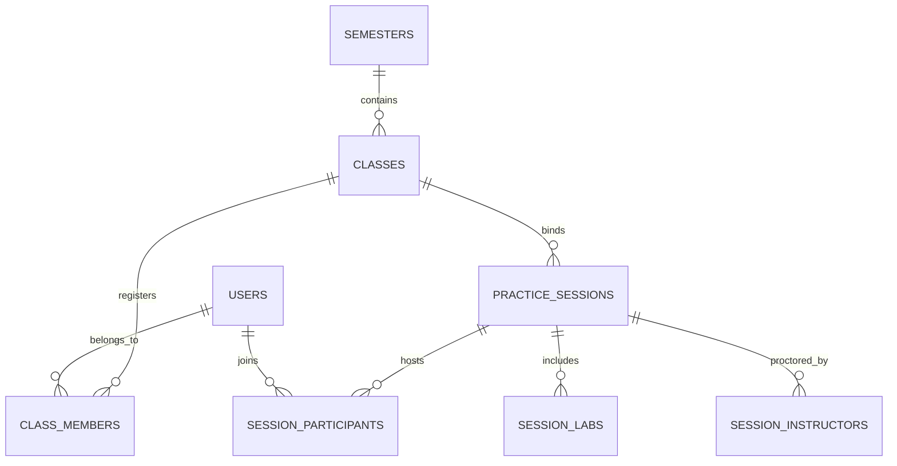

# Đặc tả Thiết kế: Hệ thống Quản lý Ca thực hành & Học vụ (Giai đoạn 7)

Tài liệu này đặc tả thiết kế kiến trúc cơ sở dữ liệu, các endpoints API và cơ chế hoạt động khóa cứng học trình trên client-side dành cho học sinh trong các ca thi thực hành/thi cử.

---

## 1. Mô hình Dữ liệu (Database Schema)

Để hỗ trợ đầy đủ các yêu cầu quản lý lớp học, học kỳ và ca thực hành chuyên sâu, chúng tôi thiết lập các bảng SQLite sau:

### 1.1 Bảng `semesters` (Học kỳ)
Lưu thông tin về học kỳ chính thức trong trường:
- `id` (TEXT PRIMARY KEY): UUID học kỳ.
- `name` (TEXT NOT NULL): Tên học kỳ (ví dụ: "Học kỳ 1 - 2025-2026").
- `start_date` (TEXT): Thời gian bắt đầu.
- `end_date` (TEXT): Thời gian kết thúc.

### 1.2 Bảng `classes` (Lớp học)
- `id` (TEXT PRIMARY KEY): UUID lớp.
- `name` (TEXT NOT NULL): Tên lớp môn học (ví dụ: "An toàn thông tin - Nhóm 01").
- `subject_id` (TEXT NOT NULL): Liên kết tới mã môn học trong hệ thống (in-memory).
- `semester_id` (TEXT NOT NULL): Khóa ngoại tham chiếu đến `semesters(id)`.

### 1.3 Bảng `class_members` (Thành viên lớp)
Bảng trung gian phân quyền học sinh/giảng viên thuộc lớp:
- `class_id` (TEXT): Khóa ngoại tham chiếu `classes(id)`.
- `user_id` (TEXT): Khóa ngoại tham chiếu `users(id)`.
- `role_in_class` (TEXT): Vai trò (`student` hoặc `instructor`).
- PRIMARY KEY (`class_id`, `user_id`).

### 1.4 Bảng `practice_sessions` (Ca thực hành/thi)
- `id` (TEXT PRIMARY KEY): UUID ca thi.
- `name` (TEXT NOT NULL): Tên ca thi.
- `banner_url` (TEXT): Ảnh đại diện ca thi (nếu có).
- `location` (TEXT): Phòng máy hoặc phòng thi (ví dụ: "Phòng Máy 402-A2").
- `class_id` (TEXT NOT NULL): Khóa ngoại tham chiếu `classes(id)`.
- `start_time` (TEXT NOT NULL): Thời gian mở đề thi (ISO).
- `end_time` (TEXT NOT NULL): Thời gian thu bài thi (ISO).
- `status` (TEXT NOT NULL): Trạng thái ca thi (`draft`, `scheduled`, `active`, `frozen`, `ended`).
- `allow_browser` (BOOLEAN): 1 nếu cho phép sinh viên rời tab hoặc dùng trình duyệt tự do, 0 nếu muốn theo dõi cảnh báo.
- `freeze_before_end_minutes` (INTEGER): Thời gian đóng băng bảng xếp hạng trước khi hết giờ (ví dụ: 15 phút).
- `penalty_minutes_per_wrong_submit` (INTEGER): Phạt cộng dồn thời gian (phút) khi nộp bài sai.
- `submission_mode` (TEXT): Kiểu chấm điểm (`auto` - tự động, `manual` - chấm thủ công qua file upload).
- `created_by` (TEXT): Giảng viên tạo ca thi, tham chiếu `users(id)`.

### 1.5 Bảng `session_labs` (Bài tập trong ca)
- `session_id` (TEXT): Khóa ngoại tham chiếu `practice_sessions(id)`.
- `lab_id` (TEXT NOT NULL): Mã bài lab tương ứng.
- PRIMARY KEY (`session_id`, `lab_id`).

### 1.6 Bảng `session_participants` (Sinh viên tham gia ca)
- `session_id` (TEXT): Khóa ngoại tham chiếu `practice_sessions(id)`.
- `user_id` (TEXT): Khóa ngoại tham chiếu `users(id)`.
- `exam_room` (TEXT): Phòng thi cụ thể của sinh viên.
- `seat_ip` (TEXT): IP máy của sinh viên tại phòng thi.
- `hostname` (TEXT): Tên máy tính tại phòng thi.
- `variant_code` (TEXT): Mã đề bài thi được phát (ví dụ: "Đề số 01").
- `status` (TEXT): Trạng thái làm bài (`not_submitted`, `submitted`).
- PRIMARY KEY (`session_id`, `user_id`).

### 1.7 Bảng `session_instructors` (Giảng viên coi thi)
- `session_id` (TEXT): Khóa ngoại tham chiếu `practice_sessions(id)`.
- `user_id` (TEXT): Khóa ngoại tham chiếu `users(id)`.
- `duty` (TEXT): Nhiệm vụ phân công (`owner` - chủ phòng máy, `proctor` - trợ giảng/giám thị).
- PRIMARY KEY (`session_id`, `user_id`).

---

## 2. Thiết kế Endpoints API

Toàn bộ các API đều được bảo vệ nghiêm ngặt qua token JWT của sinh viên và giảng viên.

| HTTP Method | Route PATH | Phân quyền yêu cầu | Mô tả |
|---|---|---|---|
| **GET** | `/semesters` | Sinh viên, Giảng viên | Lấy danh sách toàn bộ học kỳ. |
| **POST** | `/semesters` | Giảng viên, Admin | Tạo học kỳ mới. |
| **GET** | `/classes` | Sinh viên, Giảng viên | Lấy danh sách lớp học liên kết. |
| **POST** | `/classes` | Giảng viên, Admin | Tạo lớp học mới. |
| **GET** | `/classes/:id/members` | Giảng viên, Admin | Lấy danh sách sinh viên thuộc lớp. |
| **POST** | `/classes/:id/members` | Giảng viên, Admin | Thêm sinh viên/giảng viên vào lớp học. |
| **GET** | `/sessions` | Sinh viên, Giảng viên | Lấy danh sách ca thi (Giảng viên xem ca phụ trách, Sinh viên xem ca thi được giao). |
| **GET** | `/sessions/active` | Sinh viên | Trả về ca thi đang hoạt động (`active`) của sinh viên hiện tại. |
| **GET** | `/sessions/:id` | Sinh viên, Giảng viên | Lấy chi tiết ca thi kèm danh sách bài tập, sinh viên và proctors. |
| **POST** | `/sessions` | Giảng viên, Admin | Tạo mới ca thực hành (Transaction gán bài + tự động seed sinh viên). |
| **PUT** | `/sessions/:id` | Giảng viên, Admin | Cập nhật cấu hình ca thực hành và danh sách gán bài/sinh viên. |
| **DELETE** | `/sessions/:id` | Giảng viên, Admin | Xóa ca thi (Đặt `session_id = NULL` ở submissions để giữ toàn vẹn DB). |
| **POST** | `/sessions/:id/import` | Giảng viên, Admin | Import hàng loạt sinh viên từ CSV (tự động tạo tài khoản dạng `student123`). |

---

## 3. Cơ chế Khóa cứng Học trình (Active Session Lock)

Cơ chế này đảm bảo tính nghiêm túc trong phòng thi và ngăn chặn sinh viên làm bài tự do hoặc tráo đề.

### 3.1 Luồng khóa cứng giao diện Sinh viên
1. Khi sinh viên đăng nhập và truy cập giao diện bài lab (`/labs`):
   - Client gửi request gọi API `/sessions/active`.
   - Nếu backend trả về thông tin ca thi đang hoạt động:
     - Giao diện chuyển sang chế độ **Exam Mode** chuyên dụng.
     - Ẩn toàn bộ thanh tìm kiếm, bộ lọc khoa, môn học và các tab lọc tiến độ để sinh viên không thể đổi môn học.
     - Danh sách bài lab hiển thị chỉ lọc lấy các bài lab thuộc `activeSession.labIds` (ví dụ: `sum_two_numbers`).
     - Một biểu ngữ Glassmorphism màu đỏ nhấp nháy nổi bật được dựng lên ở đầu trang hiển thị: Tên ca thi, Phòng máy, Lớp môn học, Mã đề thi và thời gian thi còn lại.

### 3.2 Luồng nộp bài & Countdown tại Workspace
1. Trong Workspace (`/labs/[labId]`):
   - Đầu trang Workspace sẽ bổ sung đồng hồ đếm ngược **Timer** hiển thị số giờ, phút, giây còn lại cập nhật từng giây.
   - Khi thời gian còn dưới 5 phút, đồng hồ sẽ chuyển sang màu đỏ và nhấp nháy để nhắc nhở sinh viên nộp bài.
   - Khi sinh viên bấm "Nộp bài" hoặc "Chạy thử testcase", request gửi tới `/submit` hoặc `/upload-submit` sẽ tự động đính kèm `sessionId` của ca thi đang diễn ra.
   - Cơ sở dữ liệu SQLite ghi nhận lượt nộp bài này trực tiếp gắn với `session_id` phục vụ công việc chấm điểm thi và giám sát sau này.

---

## 4. Thiết kế Dashboard Giảng viên

Kế thừa các cấu trúc UI cao cấp từ `next-shadcn-dashboard-starter`:
- **Thống kê nhanh (Stats Cards):** 3 thẻ Card ở đầu trang hiển thị tổng số ca thi, ca đang diễn ra (Active) và ca kết thúc để giảng viên theo dõi tổng quan.
- **Bảng ca thi (Data Table):** Sử dụng các Badge trạng thái đẹp mắt của shadcn (`secondary` cho nháp, `emerald` nhấp nháy cho Active, và `destructive` cho ca kết thúc).
- **Hộp thoại Cấu hình (Tabs Form):** Tách biệt biểu mẫu tạo ca thi thành 4 Tabs trực quan để tránh rối mắt:
  - *Tab 1: Thông tin chung* (Tên ca thi, địa điểm, lớp, thời gian).
  - *Tab 2: Quy tắc & Điểm* (Bảo mật trình duyệt, đóng băng bảng điểm, phạt nộp sai, chấm tự động/thủ công).
  - *Tab 3: Bộ bài tập* (Tự động tải danh sách bài lab dựa trên môn học của lớp đã chọn, cho phép tích chọn nhiều bài lab).
  - *Tab 4: Sinh viên* (Cung cấp trường Textarea cho phép Giảng viên dán nhanh đoạn text dạng CSV để import hàng loạt sinh viên trong 1 giây).
