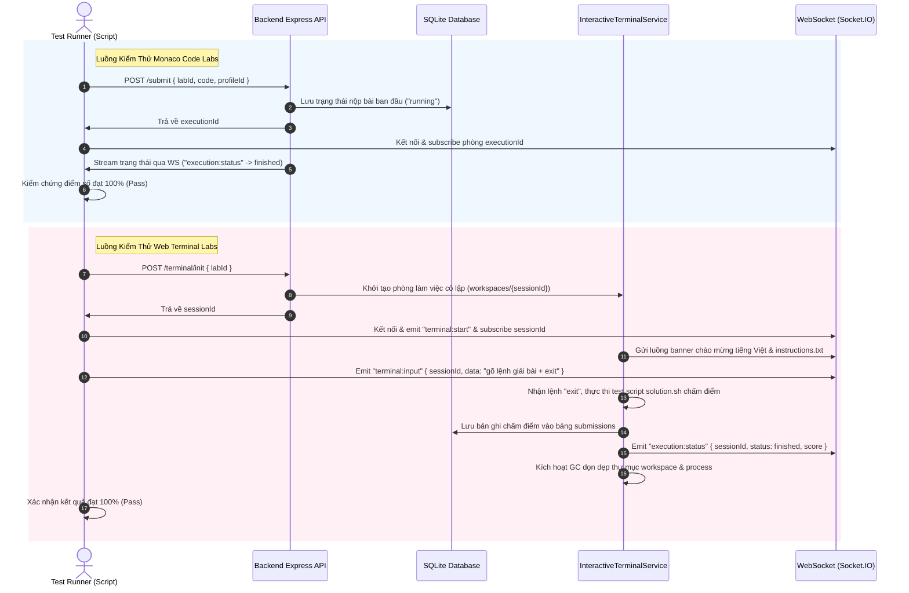

# 🛡️ KỊCH BẢN KIỂM THỬ TOÀN DIỆN HỆ THỐNG LAB (CLOUD LAB TESTING SCENARIOS)

> Tài liệu đặc tả các kịch bản kiểm thử tự động và thủ công cho toàn bộ **9 bài lab thực hành** trên nền tảng Cloud Lab.
> Đảm bảo tính toàn vẹn của hệ thống chấm điểm tự động (Auto-grading), môi trường ảo hóa cô lập (PTY workspaces), và cơ chế dọn dẹp tài nguyên (Resource GC).

---

## 🏛️ 1. Tổng Quan Kiến Trúc Kiểm Thử

Hệ thống Cloud Lab hỗ trợ hai loại hình bài thực hành chính:
1. **Monaco Code Lab (`single_runtime` / code-based `single_machine`)**: Học viên viết mã nguồn (Python, Node.js, C++, Java), chạy thử (Run) hoặc nộp bài (Submit). Hệ thống chấm điểm dựa trên danh sách các testcase được định nghĩa trong `ProblemRegistry`.
2. **Web Terminal Lab (`single_machine` / VM-based)**: Học viên tương tác trực tiếp qua môi trường dòng lệnh ảo hóa (PTY Bash shell). Hệ thống chấm điểm tự động dựa trên hành vi (Behavior-based grading) ngay khi học viên thoát khỏi console (`exit`).



---

## ⚙️ 2. Ma Trận Dữ Liệu Kiểm Thử & Lời Giải Mẫu (Reference Solutions)

Dưới đây là kịch bản chi tiết và giải pháp mẫu (đáp án chuẩn) cho từng bài lab đảm bảo đạt điểm số tuyệt đối **100/100**:

### 🎯 Nhóm 1: Môn Cấu Trúc Dữ Liệu & Giải Thuật (Software Engineering)

#### 1. Bài Lab: Sum Two Numbers (`sum_two_numbers`)
*   **Loại hình**: Monaco Code (Python)
*   **Mô tả**: Tính tổng hai số nhập vào từ luồng vào chuẩn.
*   **Kịch bản kiểm thử**:
    *   *Input mẫu*: `5 7` | *Output mong muốn*: `12`
    *   *Input mẫu*: `-3 8` | *Output mong muốn*: `5`
*   **Lời giải mẫu chuẩn (Reference Solution)**:

```python
import sys
num = sys.stdin.read().split()
if num:
    print(int(num[0]) + int(num[1]))
```

#### 2. Bài Lab: Thu gọn dãy số (`problem_array_reduction`)
*   **Loại hình**: Monaco Code (Python)
*   **Mô tả**: Cho dãy số gồm $N$ phần tử. Thu gọn dãy bằng cách loại bỏ các cặp số kề nhau có tổng là số chẵn cho đến khi không còn cặp nào. In ra độ dài dãy số cuối cùng.
*   **Kịch bản kiểm thử**:
    *   *Input mẫu*: `3 \n 1 5 3` | *Output mong muốn*: `1` (cặp `1 5` tổng chẵn bị xóa, còn lại `3`)
    *   *Input mẫu*: `4 \n 2 4 6 8` | *Output mong muốn*: `0` (tất cả đều bị xóa)
*   **Lời giải mẫu chuẩn (Reference Solution)**:

```python
import sys
lines = sys.stdin.read().split()
if not lines:
    sys.exit(0)
n = int(lines[0])
arr = [int(x) for x in lines[1:n+1]]
stack = []
for x in arr:
    if stack and (stack[-1] + x) % 2 == 0:
        stack.pop()
    else:
        stack.append(x)
print(len(stack))
```

---

### 🛡️ Nhóm 2: Môn An Toàn Mạng (Network Security)

#### 3. Bài Lab: Identifying SSH Port (`lab_nmap_ssh`)
*   **Loại hình**: Monaco Code (Python)
*   **Mô tả**: Xác định cổng dịch vụ SSH đang mở trên IP máy chủ mục tiêu `172.25.0.2`.
*   **Kịch bản kiểm thử**:
    *   *Input mẫu*: `172.25.0.2` | *Output mong muốn*: `Port 2005 is OPEN`
*   **Lời giải mẫu chuẩn (Reference Solution)**:

```python
import sys
ip = sys.stdin.read().strip()
if ip == "172.25.0.2":
    print("Port 2005 is OPEN")
```

#### 4. Bài Lab: Dynamic Analysis of WinlockerVB6Blacksod (`lab_winlocker_analysis`)
*   **Loại hình**: **Web Terminal (PTY VM)**
*   **Mô tả**: Môi trường giả lập Cyber Range cô lập an toàn. Yêu cầu sinh viên tạo một script `solution.sh` đọc file log hành vi và in ra file bị mã hóa cùng IP máy chủ điều khiển C2 của mã độc Winlocker.
*   **Kịch bản kiểm thử**:
    1.  Khởi tạo Terminal. Hệ thống tự động tạo thư mục cô lập `workspaces/{sessionId}` và seed tệp:
        *   `/opt/malware/WinlockerVB6Blacksod.exe`
        *   `strace.log` (chứa hành vi ghi file `C:\users\public\encrypted_data.txt`)
        *   `ret.pcap` (chứa lưu lượng kết nối IP `172.25.0.100`)
    2.  Học viên gõ hoặc truyền script giải bài tạo file `solution.sh`.
    3.  Thoát console bằng lệnh `exit`.
    4.  Hệ thống chạy tự động `bash solution.sh`, kiểm chứng đầu ra khớp:
        *   `ENCRYPTED_FILE: C:\users\public\encrypted_data.txt`
        *   `C2_IP: 172.25.0.100`
*   **Kịch bản giải tự động (Test Script Input)**:

```bash
cat << 'EOF' > solution.sh
#!/bin/bash
echo "ENCRYPTED_FILE: C:\\users\\public\\encrypted_data.txt"
echo "C2_IP: 172.25.0.100"
EOF
exit
```

---

### 🔑 Nhóm 3: Môn Mật Mã Học Ứng Dụng (Cryptography)

#### 5. Bài Lab: HMAC-SHA256 calculation (`lab_hmac_hash`)
*   **Loại hình**: Monaco Code (Node.js)
*   **Mô tả**: Tính giá trị HMAC-SHA256 của một thông điệp với khóa bí mật cho trước từ stdin.
*   **Kịch bản kiểm thử**:
    *   *Input mẫu*: `hello\nsecret` | *Output*: `f9e727fb3ae488a7202b204c37d0c5a354dfa220cfc34d4554b5f48bbfde322d`
*   **Lời giải mẫu chuẩn (Reference Solution)**:

```javascript
const crypto = require('crypto');
const fs = require('fs');
const input = fs.readFileSync(0, 'utf8').trim().split('\n');
if (input.length >= 2) {
  const message = input[0];
  const secret = input[1];
  const hmac = crypto.createHmac('sha256', secret).update(message).digest('hex');
  console.log(hmac);
}
```

#### 6. Bài Lab: Task 1 — Generate Hash (`lab_gen_hash`)
*   **Loại hình**: Monaco Code / CLI Shell (Shell CLI)
*   **Mô tả**: Viết script Bash đọc thông điệp từ stdin và in ra các giá trị hash MD5, SHA1, SHA256 dưới định dạng đối tượng JSON.
*   **Lời giải mẫu chuẩn (Reference Solution)**:

```bash
#!/bin/bash
read -r msg
md5=$(printf "%s" "$msg" | md5sum | awk '{print $1}')
sha1=$(printf "%s" "$msg" | sha1sum | awk '{print $1}')
sha256=$(printf "%s" "$msg" | sha256sum | awk '{print $1}')
echo "{\"md5\": \"$md5\", \"sha1\": \"$sha1\", \"sha256\": \"$sha256\"}"
```

#### 7. Bài Lab: Task 2 — HMAC via OpenSSL CLI (`lab_openssl_hmac`)
*   **Loại hình**: Monaco Code / CLI Shell (Shell CLI)
*   **Mô tả**: Viết script Bash sử dụng công cụ dòng lệnh `openssl` để tính HMAC-SHA256 của thông điệp với khóa `"secret"`.
*   **Lời giải mẫu chuẩn (Reference Solution)**:

```bash
#!/bin/bash
read -r msg
printf "%s" "$msg" | openssl dgst -sha256 -hmac "secret" | sed 's/SHA2-256(stdin)= /SHA256(stdin)= /'
```

#### 8. Bài Lab: Task 3 — Avalanche Effect (`lab_avalanche`)
*   **Loại hình**: Monaco Code / CLI Shell (Shell CLI)
*   **Mô tả**: Phân tích hiệu ứng thác tuyết (Avalanche Effect). Nhận 2 dòng văn bản đầu vào khác nhau 1 ký tự, tính mã băm SHA256 của chúng và in ra `PASS` nếu số ký tự hex khác biệt > 32 (50%), ngược lại in ra `FAIL`.
*   **Lời giải mẫu chuẩn (Reference Solution)**:

```bash
#!/bin/bash
read -r l1
read -r l2
h1=$(printf "%s" "$l1" | sha256sum | awk "{print \$1}")
h2=$(printf "%s" "$l2" | sha256sum | awk "{print \$1}")
python3 -c "
s1 = '$h1'
s2 = '$h2'
diff = sum(1 for a, b in zip(s1, s2) if a != b)
print('PASS' if diff > 32 else 'FAIL')
"
```

#### 9. Bài Lab: Task 4 — Simple Brute-force (`lab_bruteforce_mock`)
*   **Loại hình**: Monaco Code / CLI Shell (Shell CLI)
*   **Mô tả**: Viết script Bash tìm kiếm một số nguyên từ `0` đến `100000` sao cho mã băm SHA256 của số đó bắt đầu bằng chuỗi ký tự hex mục tiêu được nhập từ stdin.
*   **Kịch bản kiểm thử**:
    *   *Input mẫu*: `5feceb` | *Output mong muốn*: `0`
*   **Lời giải mẫu chuẩn (Reference Solution)**:

```bash
#!/bin/bash
read -r target
python3 -c "
import hashlib
for i in range(100001):
    h = hashlib.sha256(str(i).encode()).hexdigest()
    if h.startswith('$target'):
        print(i)
        break
"
```

---

## 🛠️ 3. Quy Trình Chạy Kiểm Thử Tự Động Toàn Diện

Hệ thống đã được trang bị bộ kiểm thử tự động tích hợp hoàn chỉnh tại `project/backend/test_all_labs.js` để tự động hóa toàn bộ quá trình xác minh.

### Bước 1: Khởi động môi trường và xử lý Headless Crash
Để tránh lỗi `AttachConsole failed` đặc thù khi khởi động Native PTY trên môi trường Windows chạy nền (headless), đảm bảo file cấu hình `.env` ở backend đã kích hoạt chế độ giả lập an toàn:
```ini
MOCK_PTY=true
```

### Bước 2: Khởi động các Máy chủ Dịch vụ
Khởi chạy Backend Server:
```bash
cd project/backend
npm run dev
```

### Bước 3: Chạy Script Kiểm Thử
Sử dụng Node.js chạy trực tiếp script chấm điểm tích hợp:
```bash
cd project/backend
node test_all_labs.js
```

### Bước 4: Kiểm tra kết quả trong SQLite Database
Mọi lượt nộp bài tự động từ script test sẽ được lưu vĩnh viễn vào SQLite. Có thể truy vấn file cơ sở dữ liệu `project/backend/lab_platform.db` để kiểm tra:
```sql
SELECT lab_id, score, status, created_at FROM submissions ORDER BY created_at DESC LIMIT 9;
```

---

## 🔒 4. Edge Cases & Cơ Chế Phục Hồi An Toàn (Resilience Scenarios)

Hệ thống được thiết kế để vượt qua các tình huống lỗi và đảm bảo an ninh thông tin:

1.  **Lỗi tắt trình duyệt đột ngột (Socket Disconnect)**:
    *   *Kịch bản*: Học viên đang thực hành Web Terminal mà đột ngột đóng tab hoặc mất mạng.
    *   *Cơ chế xử lý*: `InteractiveTerminalService` lắng nghe sự kiện `disconnect`, kích hoạt thời gian chờ ân hạn (grace period) 10 giây. Nếu không kết nối lại, hệ thống tự động lưu file `solution.sh` hiện có, kích hoạt chấm điểm tự động, cập nhật điểm số hiện tại vào SQLite và dọn dẹp sạch sẽ tài nguyên.
2.  **Tràn bộ nhớ & Zombie Processes (Resource Garbage Collection)**:
    *   *Kịch bản*: Các tiến trình Shell ảo hoặc Docker container bị treo vô hạn (vòng lặp vô tận).
    *   *Cơ chế xử lý*: Session có bộ định thời timeout 8 phút. Khi kết thúc phiên (qua `exit` hoặc `disconnect` quá 10 giây), hệ thống thực thi `ptyProcess.kill()` để dừng toàn bộ cây tiến trình con và gọi `fs.rmSync()` xóa sạch thư mục workspace cô lập tương ứng, giải phóng RAM và ổ đĩa 100%.
3.  **Lỗi bảo mật phá hoại Sandbox (Directory Traversal)**:
    *   *Kịch bản*: Sinh viên cố gắng gõ lệnh phá hoại như `rm -rf /` hoặc đọc file cấu hình hệ thống bằng `cat ../../.env`.
    *   *Cơ chế xử lý*: Môi trường MockPTY hoặc Docker Sandbox được thiết kế để chỉ cho phép các thao tác đọc ghi trong thư mục cô lập `project/backend/workspaces/{sessionId}`. Các đường dẫn tương đối `..` đều bị kiểm tra chặt chẽ hoặc bị chặn đứng ở tầng PTY shell.

---
> [!NOTE]
> Tài liệu này được biên soạn và cập nhật tự động để phản ánh đúng thực tế mã nguồn và kiến trúc nền tảng.
