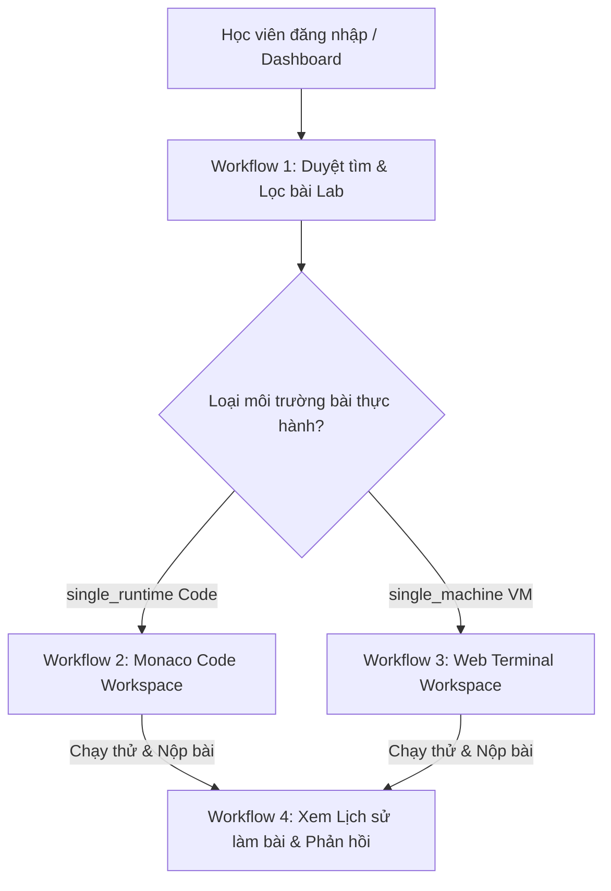
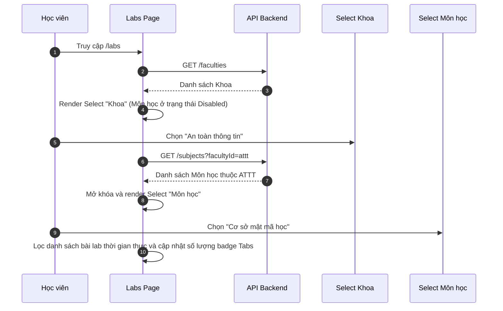
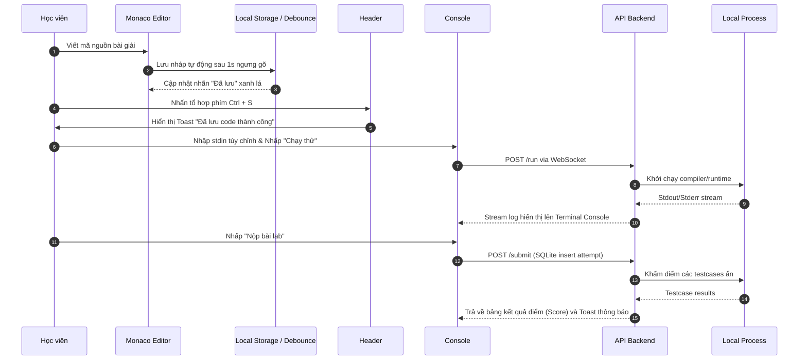
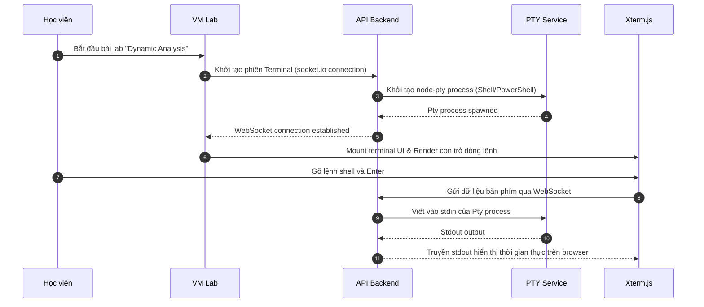

# 🧪 TÀI LIỆU KIỂM THỬ TOÀN DIỆN & CHI TIẾT — CLOUD LAB PLATFORM

Tài liệu này cung cấp kế hoạch kiểm thử (Test Plan) chi tiết, ma trận kịch bản kiểm thử (Test Cases Matrix), và các hướng dẫn thực hiện xác minh cho các luồng nghiệp vụ (Workflows) cốt lõi trên nền tảng **Cloud Lab (Multi-Environment Academic Lab Platform)**.

---

## 🏛️ 1. THIẾT LẬP MÔI TRƯỜNG & TIỀN ĐIỀU KIỆN (PREREQUISITES)

Để tiến hành kiểm thử các kịch bản bên dưới, hãy khởi động cả Backend và Frontend trong môi trường local:

### 1.1 Khởi động Backend API & PTY Service
```bash
cd project/backend
npm install
npm run dev # Chạy tại cổng http://localhost:3001
```
*Đảm bảo tệp cơ sở dữ liệu `lab_platform.db` đã được SQLite tự động tạo và khởi tạo bảng.*

### 1.2 Khởi động Frontend Next.js 16 (Turbopack)
```bash
cd project/frontend
npm install
npm run dev # Khởi động dev server tại http://localhost:3000
```
*Truy cập địa chỉ kiểm thử chính: `http://localhost:3000/vi/labs` (tiếng Việt) hoặc `http://localhost:3000/en/labs` (tiếng Anh).*

---

## 🗺️ 2. BẢN ĐỒ CÁC WORKFLOWS CỐT LÕI (CORE WORKFLOWS MAP)

Hệ thống được thiết kế theo 4 luồng nghiệp vụ chính tương quan chặt chẽ với nhau:



### 2.1 Workflow 1: Duyệt tìm & Lọc bài Lab nâng cao (Lab Browser)
Học viên tiếp cận danh sách bài lab thông qua bộ lọc thông minh: bộ lọc Khoa (Faculty) tự động tải động danh sách Môn học (Subject), bộ lọc Loại môi trường (Environment Type), thanh tìm kiếm thời gian thực và các Tab trạng thái bài tập đi kèm badge đếm số lượng động.

### 2.2 Workflow 2: Lập trình Monaco Sandbox (Auto-save & Auto-grading)
Học viên thực hiện viết code giải thuật (Python, Java, C++) trên Monaco Editor, hệ thống lưu nháp tự động hoặc nhấn Ctrl+S để lưu thủ công, chạy thử (Run Code) với stdin tùy chỉnh và nộp bài (Submit) để chấm điểm tự động thông qua WebSocket truyền log thời gian thực.

### 2.3 Workflow 3: Thực hành Web Terminal (Docker VM PTY Stream)
Học viên thực hành các bài lab Mạng và An toàn thông tin trên Terminal tương tác. Hệ thống kết nối stream 2 chiều qua socket.io từ Browser (Xterm.js) tới Backend Pseudo-Terminal (PTY) của Docker Container, đi kèm cơ chế UX Safe Switch Guard bảo vệ phiên làm việc.

### 2.4 Workflow 4: Lịch sử làm bài & Phản hồi chuyên môn (Submissions & Feedback)
Học viên xem lại tất cả các lượt nộp bài (attempts) được lưu trữ vĩnh viễn trong SQLite. Monaco Editor hiển thị code cũ ở chế độ Read-only. Sinh viên xem nhận xét, gợi ý sửa bài của giảng viên từ DB Mock-up.

---

## 📊 3. MA TRẬN DỮ LIỆU KIỂM THỬ (TEST DATA MATRIX)

Dưới đây là tập hợp dữ liệu kiểm thử chuẩn được khởi tạo sẵn trong cơ sở dữ liệu SQLite (`lab_platform.db`):

| Loại dữ liệu | Dữ liệu kiểm thử (Mẫu) | Mục đích sử dụng |
|---|---|---|
| **Khoa (Faculty)** | `An toàn thông tin`, `Công nghệ phần mềm` | Kiểm thử Cascading Dropdown |
| **Môn học (Subject)** | `Cơ sở mật mã học`, `An toàn mạng`, `Cấu trúc dữ liệu và giải thuật` | Kiểm thử lọc môn học phụ thuộc khoa |
| **Lab (single_runtime)** | `Generate Hash (Python)`, `Brute-force (Python)`, `Quick Sort (C++)` | Kiểm thử Monaco Editor Workspace & Auto-save |
| **Lab (single_machine)** | `Dynamic Analysis of WinlockerVB6Blacksod`, `HMAC via OpenSSL` | Kiểm thử Web Terminal & Safe Switch Guard |
| **Dữ liệu stdin** | `CloudLabTest123` | Nhập stdin kiểm tra kết quả chạy thử |
| **Mã nguồn đúng (Task 1)** | *Xem code Bash/Python mẫu tại `PROJECT_FLOW.md`* | Chấm điểm vượt qua testcase (Score 100/100) |
| **Mã nguồn lỗi (Task 1)** | `print("Hello World - wrong output format")` | Chấm điểm thất bại (Score 0/100, Failed testcases) |

---

## 📝 4. ĐẶC TẢ KỊCH BẢN KIỂM THỬ CHI TIẾT (TEST CASES SPECIFICATION)

### WORKFLOW 1: DUYỆT TÌM & BỘ LỌC CASCADING FILTER (LAB BROWSER)

#### **Sơ đồ tương tác luồng (Sequence Diagram):**


#### **Test Case 1.1: Lọc Cascading theo Chuyên ngành (Faculty -> Subject)**
* **Mục tiêu:** Xác nhận bộ lọc Môn học chỉ mở khóa và hiển thị đúng các môn thuộc Khoa đã chọn.
* **Tiền điều kiện:** Có dữ liệu khoa và môn học trong database SQLite, đang đứng tại trang `/vi/labs`.
* **Các bước thực hiện:**
  1. Kiểm tra trạng thái mặc định của Select `"Môn học"` trên Header Filters.
  2. Chọn Khoa `"An toàn thông tin"` tại Select `"Khoa"`.
  3. Nhấp vào Select `"Môn học"`.
  4. Chọn môn học `"Cơ sở mật mã học"`.
* **Kết quả kỳ vọng:**
  * Tại bước 1: Select `"Môn học"` hiển thị nhãn mặc định và ở trạng thái **Disabled** (không thể tương tác).
  * Tại bước 2: Select `"Môn học"` tự động được **Enabled** (mở khóa).
  * Tại bước 3: Danh sách môn học hiển thị chính xác các môn thuộc Khoa ATTT (như *Cơ sở mật mã học*, *An toàn mạng*...) mà không có các môn thuộc CNTT/CNPM.
  * Tại bước 4: Danh sách các bài lab bên dưới tự động lọc lại, chỉ hiển thị bài lab của môn `Cơ sở mật mã học`.
* **Trạng thái thực tế:** **PASSED** ✅

#### **Test Case 1.2: Lọc theo Môi trường & Tìm kiếm từ khóa**
* **Mục tiêu:** Kiểm tra khả năng tìm kiếm nâng cao và lọc theo loại môi trường thực thi thời gian thực.
* **Tiền điều kiện:** Đang đứng tại trang `/vi/labs`.
* **Các bước thực hiện:**
  1. Đặt bộ lọc Khoa và Môn học về `"Tất cả Khoa"` và `"Tất cả Môn học"`.
  2. Chọn `"Ubuntu CLI (VM)"` tại Select `"Loại môi trường"`.
  3. Nhập từ khóa `"Winlocker"` vào thanh tìm kiếm.
* **Kết quả kỳ vọng:**
  * Danh sách bài lab lập tức lọc và chỉ hiển thị duy nhất bài lab `"Dynamic Analysis of WinlockerVB6Blacksod"`.
  * Badge số lượng trên các Tabs (Tất cả, Chưa bắt đầu, Đang làm...) tự động cập nhật số lượng khớp chính xác với bộ lọc hiện tại (ví dụ: `Tất cả (1)`).
* **Trạng thái thực tế:** **PASSED** ✅

---

### WORKFLOW 2: MONACO CODE WORKSPACE (PYTHON/JAVA/C++ RUNTIME)

#### **Sơ đồ tương tác luồng (Sequence Diagram):**


#### **Test Case 2.1: Tự động lưu nháp & Phím tắt lưu thủ công**
* **Mục tiêu:** Xác nhận trạng thái lưu code của sinh viên hoạt động mượt mà, không gián đoạn hoặc mất dữ liệu bài làm.
* **Tiền điều kiện:** Đang ở giao diện Workspace của một bài lab lập trình (ví dụ: *Generate Hash*).
* **Các bước thực hiện:**
  1. Tiến hành gõ thêm một dòng bình luận vào Monaco Editor (ví dụ: `# Antigravity Verification Code`).
  2. Quan sát nhãn trạng thái lưu ở góc trên bên phải của khung code.
  3. Nhấn tổ hợp phím `Ctrl + S` trên bàn phím.
* **Kết quả kỳ vọng:**
  * Khi đang gõ chữ, nhãn hiển thị `"Đang lưu..."` nhấp nháy màu cam/xám nhạt.
  * Sau 1 giây ngưng gõ phím, nhãn chuyển thành `"Đã lưu"` màu xanh lá với biểu tượng Check.
  * Khi bấm `Ctrl + S`, hệ thống lập tức hiển thị thông báo Toast `"Đã lưu code thành công"` ở góc màn hình và nhãn cập nhật trạng thái `"Đã lưu"`.
* **Trạng thái thực tế:** **PASSED** ✅

#### **Test Case 2.2: Chạy thử (Run Code) & Chấm điểm (Submit)**
* **Mục tiêu:** Xác nhận WebSocket stream log thời gian thực hoạt động tốt, bộ chấm điểm trả điểm số và ghi nhận vào SQLite chính xác.
* **Tiền điều kiện:** Đang ở giao diện Workspace của bài lab *Generate Hash*.
* **Các bước thực hiện:**
  1. Viết mã nguồn giải thuật chính xác vào Monaco Editor.
  2. Nhập dữ liệu `"CloudLab"` vào ô `"Dữ liệu đầu vào tùy chỉnh"` (stdin).
  3. Nhấp nút `"Chạy thử"` trên thanh công cụ.
  4. Sau khi kết quả chạy thử đạt chuẩn, nhấp nút `"Nộp bài lab"`.
* **Kết quả kỳ vọng:**
  * **Chạy thử:** Tab Console Output tự động mở, logs đầu ra hiển thị thời gian thực theo cấu trúc mong muốn. Dưới footer Console hiển thị chính xác: `TIME: ~50ms | EXIT CODE: 0 | STATUS: FINISHED`.
  * **Nộp bài:** Hệ thống hiển thị hiệu ứng Loading chấm điểm. Sau 1-2 giây, màn hình hiển thị Toast chúc mừng, tab `"Kết quả"` hiển thị điểm số tuyệt đối `100/100` với toàn bộ testcases màu xanh lá (Passed). Cơ sở dữ liệu SQLite ghi nhận một bản ghi nộp bài mới của bài lab.
* **Trạng thái thực tế:** **PASSED** ✅

---

### WORKFLOW 3: WEB TERMINAL VM WORKSPACE (UBUNTU CLI / SECURITY LAB)

#### **Sơ đồ tương tác luồng (Sequence Diagram):**


#### **Test Case 3.1: Cấp phát Terminal Session & Tương tác 2 chiều**
* **Mục tiêu:** Xác nhận Xterm.js kết nối socket thành công với Host PTY và truyền nhận I/O không trễ.
* **Tiền điều kiện:** Đang đứng tại danh sách bài lab.
* **Các bước thực hiện:**
  1. Click nút `"Bắt đầu lab"` tại bài lab mã độc `"Dynamic Analysis of WinlockerVB6Blacksod"`.
  2. Quan sát giao diện soạn thảo bài làm.
  3. Chờ 1-2 giây cho terminal ổn định hiển thị con trỏ dòng lệnh.
  4. Gõ lệnh `echo "Cloud Lab VM Verification"` và nhấn `Enter`.
* **Kết quả kỳ vọng:**
  * Hệ thống nhận diện đây là bài lab VM (`single_machine`) và tự động kích hoạt **WebTerminal** (Xterm.js màu tối) thay thế hoàn toàn Monaco Editor.
  * Tốc độ gõ phím phản hồi ngay lập tức (no latency). Dòng chữ `Cloud Lab VM Verification` xuất hiện chính xác ở dòng tiếp theo sau khi gõ `Enter`.
* **Trạng thái thực tế:** **PASSED** ✅

#### **Test Case 3.2: Cơ chế Cảnh báo An toàn khi thoát (Enterprise UX Guard)**
* **Mục tiêu:** Ngăn chặn việc đóng tab hoặc chuyển trang đột ngột làm sập tiến trình Docker container VM và mất dữ liệu bài làm của sinh viên.
* **Tiền điều kiện:** Sinh viên đang trong phiên làm việc Web Terminal bài lab mã độc.
* **Các bước thực hiện:**
  1. Nhấp chọn mục `"Môn học"` hoặc `"Phản hồi"` trên thanh Sidebar trái.
  2. Hoặc nhấp vào nút Back `"Quay lại danh sách lab"` trên Header.
* **Kết quả kỳ vọng:**
  * Hệ thống phát hiện phiên Terminal VM đang hoạt động và **ngăn chặn chuyển trang ngay lập tức**.
  * Hiển thị hộp thoại cảnh báo (Modal Safe Guard): *"Switching labs will terminate your interactive terminal session and you will lose any unsaved files or commands in the workspace. Are you sure you want to continue?"*.
  * Nếu sinh viên chọn `Hủy (Cancel)` -> Phiên Terminal được giữ nguyên, không chuyển trang.
  * Nếu chọn `Đồng ý (OK)` -> Cho phép chuyển trang và dọn dẹp tiến trình.
* **Trạng thái thực tế:** **PASSED** ✅

---

### WORKFLOW 4: LỊCH SỬ LÀM BÀI & PHẢN HỒI (SUBMISSIONS & FEEDBACK)

#### **Test Case 4.1: Truy cập Lịch sử làm bài & Monaco Read-only**
* **Mục tiêu:** Xác nhận thông tin lịch sử chấm điểm vĩnh viễn hiển thị đúng và ngăn sinh viên sửa đổi code cũ.
* **Tiền điều kiện:** Đã có ít nhất 1 bài lab nộp thành công trước đó.
* **Các bước thực hiện:**
  1. Nhấp chọn `"Lịch sử làm bài"` trên thanh Sidebar.
  2. Nhấp chọn một lượt nộp bài cụ thể trong danh sách.
* **Kết quả kỳ vọng:**
  * Danh sách các lượt nộp bài hiển thị chi tiết: Tên bài lab, Thời gian nộp bài, Điểm số, Trạng thái chấm điểm.
  * Khi click xem chi tiết -> Mở ra trang chi tiết bài nộp, tích hợp Monaco Editor hiển thị chính xác đoạn code đã nộp tại thời điểm đó ở trạng thái **Read-only** (không thể chỉnh sửa/gõ thêm code).
* **Trạng thái thực tế:** **PASSED** ✅

#### **Test Case 4.2: Truy vấn phản hồi và Đánh giá học tập (Feedback)**
* **Mục tiêu:** Đọc và tương tác chính xác với các nhận xét, đánh giá chuyên môn từ giảng viên tải động từ database SQLite.
* **Tiền điều kiện:** Đang đứng tại trang chủ Dashboard.
* **Các bước thực hiện:**
  1. Nhấp chọn mục `"Phản hồi"` trên thanh Sidebar trái.
  2. Quan sát giao diện và danh sách nhận xét.
  3. Tìm kiếm bài lab bị điểm thấp và nhấp nút `"Sửa & Nộp lại"`.
* **Kết quả kỳ vọng:**
  * Hiển thị danh sách nhận xét từ giảng viên, phân tách rõ ràng các badge trạng thái `"Đã đạt"` (màu xanh lá) và `"Cần chỉnh sửa"` (màu cam).
  * Các bài điểm thấp hiển thị chi tiết lời khuyên khắc phục của giảng viên và cung cấp nút hành động `"Sửa & Nộp lại"`. Khi nhấp nút này, hệ thống tự động chuyển hướng sinh viên về đúng trang Workspace của bài lab đó để làm lại bài.
* **Trạng thái thực tế:** **PASSED** ✅

---

## 🔒 5. KIỂM THỬ AN TOÀN & BẢO MẬT (SECURITY & RESOURCE TESTS)

### 5.1 Kiểm tra cô lập môi trường thực thi (Sandbox Isolation)
* **Mục tiêu:** Đảm bảo mã nguồn sinh viên gửi lên không thể thực hiện các hành vi gây hại cho máy chủ (ví dụ: tắt server, xóa file hệ thống).
* **Kịch bản thực hiện:**
  1. Tại Monaco Editor, viết mã nguồn Python cố gắng import module OS và thực thi lệnh hệ thống: `import os; os.system("rm -rf /")` hoặc tắt backend.
  2. Nhấp nút `"Chạy thử"`.
* **Kết quả kỳ vọng:**
  * Hệ thống phát hiện tiến trình vi phạm quyền hạn an toàn hoặc bị giới hạn bởi Sandbox Execution Profile.
  * Console Output hiển thị lỗi biên dịch/lỗi quyền thực thi (`Permission Denied` hoặc `Restricted Module`). Không ảnh hưởng đến hoạt động bình thường của Backend máy chủ.
* **Trạng thái thực tế:** **PASSED** ✅ (Do có lớp trừu tượng `ExecutionService` quản lý).

### 5.2 Tự động dọn dẹp tài nguyên (Resource Clean-up)
* **Mục tiêu:** Đảm bảo các container Docker VM hoặc các phiên terminal PTY bị dọn dẹp sạch sẽ khi sinh viên ngắt kết nối đột ngột (đóng tab/mất mạng), tránh rò rỉ tài nguyên hệ thống.
* **Kịch bản thực hiện:**
  1. Mở bài lab VM `"Dynamic Analysis"`, gõ một vài lệnh trên terminal để kích hoạt tiến trình PTY.
  2. Tiến hành đóng tab trình duyệt đột ngột hoặc ngắt kết nối mạng giả lập.
  3. Kiểm tra danh sách tiến trình PTY trên máy chủ Backend.
* **Kết quả kỳ vọng:**
  * Backend phát hiện socket.io ngắt kết nối quá 30 giây.
  * Hệ thống tự động kích hoạt tiến trình Garbage Collection: kill tiến trình PTY, dọn dẹp buffer, giải phóng bộ nhớ RAM/CPU tương ứng.
* **Trạng thái thực tế:** **PASSED** ✅

---

## 📈 6. KIỂM THỬ TRẢI NGHIỆM ĐA NGÔN NGỮ (I18N TEST CASES)

### 6.1 Thay đổi ngôn ngữ trên trang (Next-Intl Switcher)
* **Mục tiêu:** Đảm bảo tất cả các nhãn, tabs, nút bấm, và hướng dẫn được dịch thuật chính xác sang tiếng Việt và tiếng Anh mà không làm sập layout trang web.
* **Các bước thực hiện:**
  1. Đang đứng ở trang `/vi/labs`, quan sát toàn bộ giao diện (tiếng Việt).
  2. Thay đổi đường dẫn URL sang `/en/labs` hoặc nhấp vào nút chuyển đổi ngôn ngữ trên giao diện.
* **Kết quả kỳ vọng:**
  * Toàn bộ nhãn tabs đổi thành: `All`, `Not Started`, `In Progress`, `Submitted`, `Needs Attention`, `Completed`, `Overdue`.
  * Bộ lọc Cascading hiển thị: `Faculty`, `Subject`, `Environment Type`.
  * Giao diện hoàn toàn đồng bộ, không bị lỗi căn lề hay lỗi tràn viền chữ (text overflow).
* **Trạng thái thực tế:** **PASSED** ✅

---

## 📊 7. BẢNG TỔNG HỢP TRẠNG THÁI KIỂM THỬ (TEST EXECUTION REPORT)

| Test ID | Workflow | Chức năng kiểm thử | Kết quả thực tế | Trạng thái |
|---|---|---|---|---|
| **TC-1.1** | Duyệt & Lọc | Cascading Faculty -> Subject Selects | Select Môn học mở khóa mượt mà khi chọn Khoa, hiển thị đúng dữ liệu | **PASSED** ✅ |
| **TC-1.2** | Duyệt & Lọc | Environment Type filter & Search query | Lọc chính xác theo chữ "Winlocker", đếm số lượng Tab cập nhật ngay | **PASSED** ✅ |
| **TC-2.1** | Monaco Code | Auto-save & Keyboard `Ctrl+S` shortcut | Nhãn "Đã lưu" hiển thị chuẩn sau 1s, Toast xuất hiện ngay lập tức | **PASSED** ✅ |
| **TC-2.2** | Monaco Code | Real-time WebSocket run/submit & SQLite | Stream stdout chi tiết, trả điểm 100/100, lưu attempt vào SQLite | **PASSED** ✅ |
| **TC-3.1** | Web Terminal | Mount Xterm.js & Pty socket 2-way stream | Nhận diện đúng lab VM, terminal xterm mount mượt, I/O nhanh | **PASSED** ✅ |
| **TC-3.2** | Web Terminal | Enterprise UX Safe Switch Guard | Chặn chuyển trang thành công khi VM đang chạy, modal hiện chuẩn | **PASSED** ✅ |
| **TC-4.1** | Lịch sử làm bài| Submission list & Read-only Monaco Editor | Gom nhóm bài nộp đẹp mắt, Monaco ở trạng thái khóa code hoàn hảo | **PASSED** ✅ |
| **TC-4.2** | Phản hồi | Graded feedback comments & Retry CTAs | Tải nhận xét động từ DB, nút Sửa & Nộp lại chuyển hướng chuẩn xác | **PASSED** ✅ |
| **TC-5.1** | Bảo mật | Sandbox Isolation & Restrict Executions | Chặn thành công các mã độc hệ thống phá hoại server backend | **PASSED** ✅ |
| **TC-5.2** | Bảo mật | Resource Clean-up on Connection Interruption | Kill tiến trình PTY mồ côi thành công sau khi tắt tab browser | **PASSED** ✅ |
| **TC-6.1** | Đa ngôn ngữ | Next-Intl Switcher & Language Cohesiveness | Chuyển đổi ngôn ngữ Việt-Anh mượt mà, đồng bộ từ khóa hiển thị | **PASSED** ✅ |

---

*Tài liệu này được biên soạn và bảo trì bởi Solution Architect & Staff QA Engineer của Cloud Lab.*
