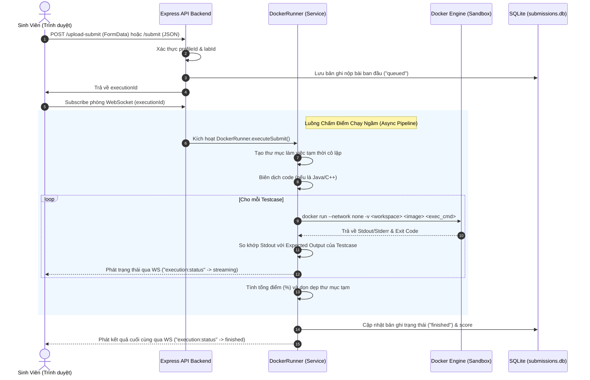
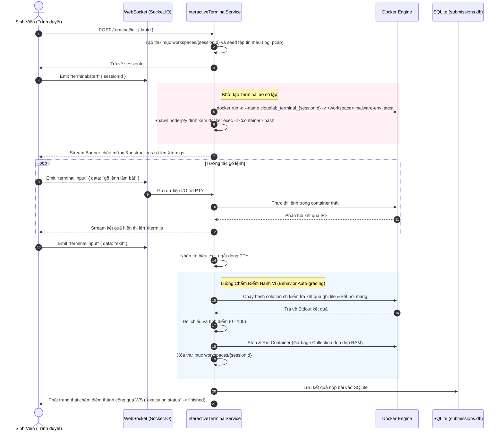
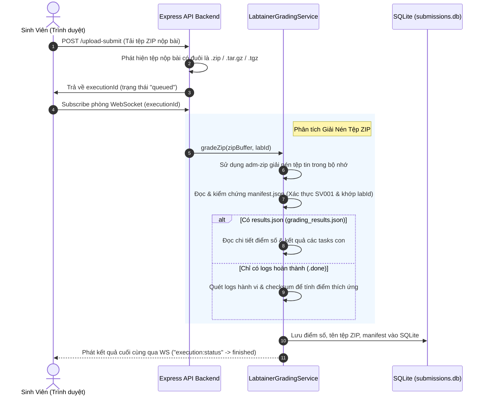

# Đặc Tả Kiến Trúc Luồng Xử Lý (Solutions Flow Document)

Tài liệu này đặc tả chi tiết kiến trúc luồng dữ liệu (Data Flow) và luồng xử lý (Execution Flow) của **4 giải pháp thực thi** cốt lõi trên nền tảng Cloud Lab. 
Đảm bảo tính trực quan bằng biểu đồ tuần tự (Sequence Diagram) và mô tả chi tiết bằng tiếng Việt chuẩn hóa.

---

## 🏛️ 1. Bản Đồ Phân Loại Giải Pháp (Solution Mapping)

Hệ thống phân loại các bài lab thực hành và định tuyến luồng xử lý dựa trên cấu hình môi trường:

| # | Giải pháp thực thi | Môi trường thực tế | Giao diện học viên | Cơ chế chấm điểm (Grading) |
|---|---------------------|----------------------|----------------------|-----------------------------|
| **1** | **Monaco Code Runner** | Docker Stateless Sandbox | Monaco Editor | So khớp Stdin/Stdout (Testcases) |
| **2** | **Standard Web Terminal** | Docker VM (`malware-env`) | Xterm.js Terminal | Quét tệp tin & Chạy script hành vi (`solution.sh`) |
| **3** | **NPS Labtainer Online** | Docker Topology (Multi-node) | Xterm.js (SSH Exec) | Chạy Core `stoplab` & `gradelab` và parse `.report` |
| **4** | **NPS Labtainer ZIP Offline** | Host Local (Offline) | Drag & Drop Zone | Giải nén ZIP (`adm-zip`), parse manifest + results |

---

## 🔄 2. Đặc Tả Chi Tiết 4 Giải Pháp & Biểu Đồ Tuần Tự (Sequence Diagrams)

---

### Luồng 1: Monaco Code Runner (`single_runtime`)
Áp dụng cho các bài lab lập trình (Python, Node.js, C++, Java), nơi học viên viết mã nguồn và chạy các testcase tự động.

---

### Luồng 2: Standard Web Terminal (`single_machine` / VM-based)
Áp dụng cho các bài thực hành hệ thống độc lập (ví dụ phân tích động mã độc `lab_winlocker_analysis`).

---

### Luồng 3: NPS Labtainer Online Integration (Real Engine)
Áp dụng cho các bài lab an toàn thông tin chuyên sâu của Labtainer (ví dụ quét cổng mạng `lab_labtainer_nmap`).

haha

---

### Luồng 4: NPS Labtainer ZIP Offline Submission (LMS Mode)
Áp dụng cho chế độ nộp bài offline, sinh viên làm bài offline trên máy tính cá nhân và nộp tệp tin kết quả ZIP để nhận điểm.

---

## 🔒 3. Cơ Chế Bảo Mật & Dọn Dẹp Tài Nguyên (Resource GC)

Hệ thống Cloud Lab được xây dựng theo tiêu chuẩn doanh nghiệp, áp dụng nghiêm ngặt các chính sách:
1. **Cô lập mạng (Network Isolation)**: Đối với các bài lab Monaco Code, Docker luôn chạy với tùy chọn `--network none` để chặn đứng hành vi tấn công ra mạng ngoài hoặc can thiệp vào host server.
2. **Giới hạn tài nguyên (Resource Limits)**: Mỗi container thực thi code luôn bị khống chế cứng ở mức `--memory 256m` và `--cpus 0.5` để ngăn ngừa tấn công từ chối dịch vụ (DoS).
3. **Thu hồi tài nguyên tự động (Garbage Collection)**:
   - *VM Terminals*: Toàn bộ container Docker và tiến trình PTY con luôn được kết thúc và xóa sạch (`docker kill` và `docker rm`) ngay khi sinh viên gõ `exit` hoặc ngắt kết nối socket quá 10 giây.
   - *Thư mục Workspace tạm*: Tự động xóa bỏ (`fs.rmSync`) toàn bộ thư mục workspaces cô lập sau khi đã chấm điểm xong để giải phóng 100% dung lượng ổ cứng.
